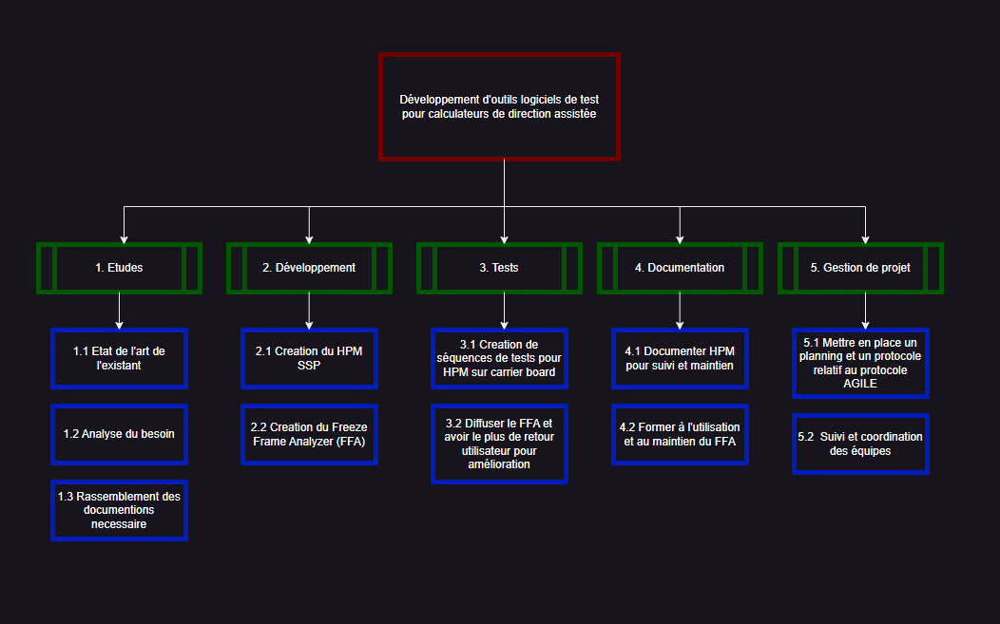
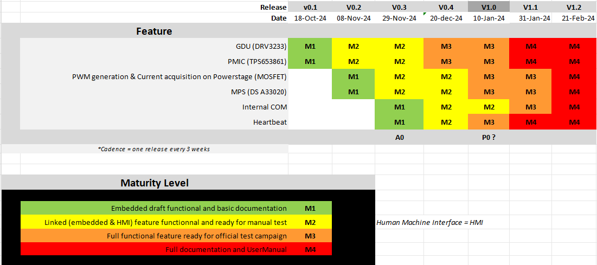
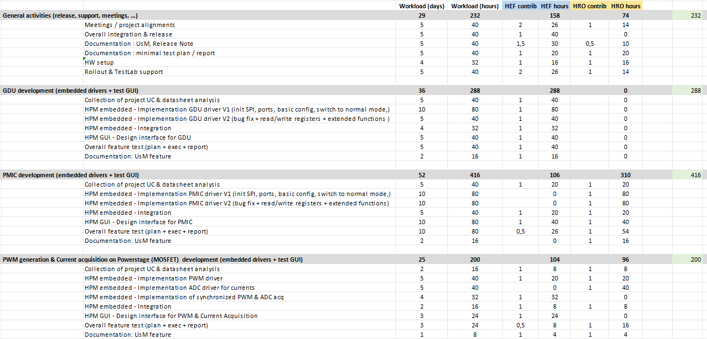
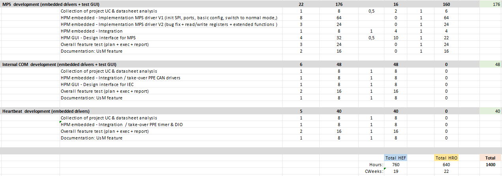
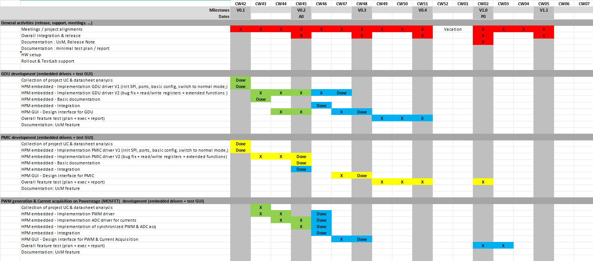
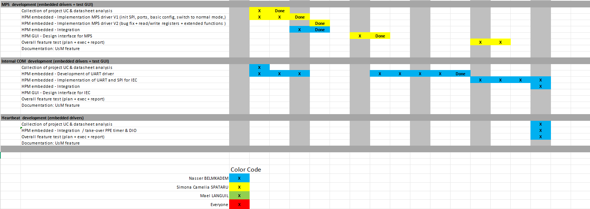
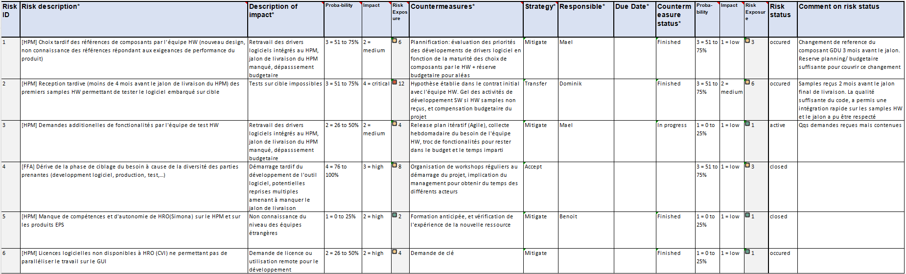

# **Table des matières**

- [**Table des figures**](#table-des-figures)
- [**1. Introduction**](#1-introduction)
- [**2. Presentation du projet**](#2-presentation-du-projet)
    - [**2.1 Contexte**](#21-contexte)
    - [**2.2 Sujet et problématique**](#22-sujet-et-problématique)
    - [**2.3 Enjeux**](#23-enjeux)
    - [**2.4 Objectifs**](#24-objectifs)
    - [**2.5 Méthode gestion de projet**](#25-méthode-gestion-de-projet)
- [**3. Mise en oeuvre**](#3-mise-en-oeuvre)
    - [**3.1 WBS (Work Breakdown Structure)**](#31-wbs-work-breakdown-structure)
    - [**3.2 Release Plan**](#32-release-plan)
    - [**3.3 PBS (Product Breakdown Structure)**](#33-pbs-product-breakdown-structure)
    - [**3.4 Planning Previsionnel**](#34-planning-previsionnel)
    - [**3.5 Analyse de risque**](#35-analyse-de-risque)
- [**4. Indicateur de réussite**](#4-indicateur-de-réussite)
- [**5. Conclusion**](#5-conclusion)

# **Table des figures**

- [**WBS**](#31-wbs-work-breakdown-structure)
- [**Release Plan**](#32-release-plan)
- [**PBS**](#33-pbs-product-breakdown-structure)
- [**Planning Prévisionnel**](#34-planning-previsionnel)
- [**Analyse de risque**](#35-analyse-de-risque)

# **Glossaire**

- PPE : Premium Plateform Electric
- ECU : Electic Controller Unit
- CLR : Customer Line Return
- FF : Freeze Frame

## **1. Introduction**

Dans le cadre de ma 5ème année de cycle d'ingénieur (FISA 27), d’Ingénieur Systèmes Electriques Electronique Embarqués (S3E), il nous est proposé de réaliser un projet de fin d’études. Ce projet constitue une opportunité d’appliquer les compétences techniques et méthodologiques acquises tout au long de ma formation, tout en développant mes capacités de gestion de projet, de management d’équipe et de pilotage budgétaire.

L’objectif de ce projet est de me confronter aux réalités du métier d’ingénieur en abordant différentes facettes essentielles : la gestion des ressources humaines et matérielles, le respect des contraintes budgétaires et des délais, ainsi que la mise en place de stratégies adaptées aux enjeux du projet. À travers ce travail, je devrai démontrer ma capacité à structurer et conduire un projet en entreprise, en respectant un cahier des charges précis et en atteignant les objectifs fixés.

Ce document définira les attendus du projet, les méthodologies de gestion employées (WBS, RBS, GANTT, OBS, PBS), ainsi que les aspects financiers et l’analyse des risques. Il servira de référence pour assurer un suivi rigoureux du projet et garantir son bon déroulement jusqu’à la soutenance prévue en septembre 2024, au cours de laquelle mon travail sera évalué en fonction des critères établis.

## **2. Presentation du projet**

### **2.1 Contexte**

FORVIA HELLA est un équipementier automobile allemand de renommée internationale, coté en bourse et spécialisé dans les technologies d'éclairage haute performance ainsi que l’électronique embarquée. Fort de son expertise, l’entreprise joue un rôle clé dans l’innovation et l’évolution du secteur automobile en fournissant des solutions avancées en matière d’électronique, d’énergie et de connectivité.

En France, la filiale de FORVIA HELLA développe et produit divers équipements destinés aux véhicules, notamment des on-board chargers, des calculateurs de direction assistée, ainsi que des transformateurs. Ces composants sont essentiels pour améliorer l’efficacité énergétique, la sécurité et la fiabilité des systèmes automobiles modernes. Grâce à une forte intégration des nouvelles technologies, FORVIA HELLA contribue activement à la transition vers des véhicules plus intelligents et durables.

### **2.2 Sujet et problématique**

La filiale française de FORVIA HELLA a lancé le développement d’un calculateur de direction assistée il y a huit ans, dans le cadre du projet PPE commandé par Volkswagen. Ce produit, récemment mis en circulation, fait désormais l’objet de retours clients signalant divers défauts. Le Customer Line Return (CLR) se charge du rapatriement des ECUs défectueux, tandis que notre entreprise est responsable de leur analyse.

À leur réception, les testeurs doivent identifier l’origine des dysfonctionnements. Pour faciliter ce diagnostic, l’entreprise a intégré dans ses calculateurs des programmes capables de générer des Freeze Frames. Ces chaînes hexadécimales contiennent un ensemble de données enregistrées au moment de l’incident (vitesse, niveau de batterie, température du calculateur, etc.), offrant ainsi un instantané des conditions dans lesquelles le problème est survenu.

De plus, FORVIA HELLA voit l’émergence de nouveaux projets, nécessitant le développement de logiciels embarqués avancés dédiés au diagnostic, appelés HPM. Ces outils doivent être capables de traiter efficacement les nouvelles générations de calculateurs de direction assistée, garantissant ainsi une meilleure fiabilité et un suivi optimisé des performances des systèmes embarqués.

### **2.3 Enjeux**

L'automatisation du décodage des Freeze Frames représente un enjeu majeur pour FORVIA HELLA, tant sur le plan technique qu'opérationnel. Actuellement, l'analyse manuelle des trames hexadécimales est une tâche chronophage, sujette aux erreurs humaines et difficilement scalable face à l’augmentation du nombre d’ECUs à traiter. En développant un outil automatisé de décodage, l’entreprise vise à réduire le temps de diagnostic, améliorer la précision des analyses et accélérer la résolution des problèmes clients.

Par ailleurs, le développement et l’évolution du HPM sont essentiels pour garantir un diagnostic toujours plus précis et performant. La mise en place de ces outils renforce non seulement la capacité de FORVIA HELLA à répondre aux exigences croissantes du secteur automobile, mais elle ouvre également la porte à de nouvelles opportunités de collaboration et d’innovation, consolidant ainsi la position de l’entreprise sur le marché des systèmes embarqués intelligents.

### **2.4 Objectifs**

Le projet vise à répondre à plusieurs objectifs clés, prenant en compte les exigences du développement logiciel pour les outils de diagnostic ainsi que les enjeux industriels liés aux calculateurs électroniques :

1. **Objectifs Techniques**

    - Concevoir des outils logiciels robustes permettant de faciliter les tests et le diagnostic des calculateurs électroniques.
    - Automatiser les tests des cartes électroniques sur la chaîne de production afin de réduire les interventions manuelles.
    - Améliorer la précision du diagnostic en minimisant les erreurs humaines dans l’analyse des Freeze Frames.
    - Concevoir une solution évolutive, capable de s’adapter aux futurs calculateurs et nouveaux formats de Freeze Frames.
    - Répondre aux évolutions technologiques pour intégrer efficacement de nouveaux projets HPM.

2. **Objectifs Humains**

    - Former les testeurs et opérateurs à l’utilisation des nouveaux outils logiciels pour garantir une adoption optimale.
    - Fournir une documentation complète et accessible pour assurer une prise en main rapide et efficace des outils.
    - Faciliter la collaboration entre les différentes équipes (France, Roumanie, Allemagne) en assurant une bonne communication des - besoins et des attentes.

3. **Objectifs Organisationnels**

    - Gérer une équipe de développement internationale, en assurant une répartition efficace des tâches et responsabilités.
    - Suivre l’approvisionnement en ressources matérielles et logicielles nécessaires pour garantir le bon déroulement du projet.
    - Assurer la livraison des outils en respectant les délais et les contraintes budgétaires.

### **2.5 Méthode gestion de projet**

Étant donné que mon projet repose principalement sur le développement logiciel, j’ai choisi d’adopter une approche Agile, qui permet une gestion flexible et itérative du projet. L’Agile pose sur une adaptation continue aux besoins et aux contraintes techniques, tout en favorisant la collaboration entre les différentes parties prenantes.

Dans cette approche, le développement est organisé en cycles itératifs et incrémentaux, où chaque itération permet de livrer une version partielle mais fonctionnelle des outils logiciels. Plutôt que de suivre un modèle strictement prédéfini, cette méthode favorise une évolution continue en fonction des retours utilisateurs et des éventuels défis techniques rencontrés au fil du projet.

Le découpage des tâches se fait en petites unités indépendantes, chacune représentant une fonctionnalité ou une amélioration spécifique du logiciel. À la fin de chaque itération, un bilan est réalisé pour ajuster les priorités et intégrer les retours des testeurs et opérateurs. Cette approche offre plusieurs avantages :

- Flexibilité et adaptation : Permet de prendre en compte les retours des testeurs en temps réel et d’adapter rapidement le développement en fonction des nouveaux besoins identifiés.
- Amélioration continue : Chaque itération permet d’optimiser les performances des outils et d’intégrer progressivement des fonctionnalités avancées.
- Suivi structuré : Grâce à une planification des itérations et des revues régulières, l’évolution du projet est claire et mesurable.

En appliquant cette méthode Agile, je peux garantir un développement progressif des outils logiciels, en optimisant leur robustesse et leur pertinence pour les utilisateurs finaux.

## **3. Mise en oeuvre**

### **3.1 WBS (Work Breakdown Structure)**

Le projet sera découpé en 5 parties bien distinctes et chaque essentiel au bon fonctionnement du projet.

Figure 1 : Work Breakdown Structure

### **3.2 Release Plan**

Après avoir organiser les besoin du projet, nous avons convenu des différents livrables necessaire pour assurer un bon suivi et maintien du projet, tout en restant réalise et humble sur notre capacité au developpement, et en priorisant le developpement des modules non susceptible de changer.

Figure 2 : Release Plan

### **3.3 PBS (Product Breakdown Structure)**

Pour structurer le projet, nous avons fait le choix de réfléchir en termes de PBS, pour ajuster les temps de travail necessaire étant donné le bug fixe alloué à ce projet, ainsi que de respecter les milestones annoncé dans le Release Plan.

Une **analyse budgetaire** a été effectué en amount pour déterminer la quantité de travailler pouvant etre attribué a ce projet.
Les couts matériels ne represente qu'une infime partie du budget car le projet est en prédeveloppement, c'est a dire que la partie production n'est pas encore calculée.

Figure 3 : Product Breakdown Structure

### **3.4 Planning Previsionnel**

Enfin pour suivre d'avancement et pour que tout le monde s'y retrouve dans le travail à fournir, j'ai constitué un planning prévisionnel melant le PBS et le Release Plan.

Figure 4 : Planning Previsionnel

### **3.5 Analyse de risque**

Enfin pour un projet comme celui ci, il est important de bien analyser les risque l'entourant, et de nous y préparer avec des contres mesures afin d'atténuer leurs impacts.
A l'aide d'un templates FORVIA HELLA et avec l'appui de mon manager M. Benoit RENON, j'ai pu réaliser cette études, avec leur probabilité et leur impact.

Figure 5 : Analyse de risque

### **4. Indicateur de réussite**

Les indicateurs de réussite seront :

- L'adoption du projet par le client
- Le respect des délais
- Une utilisation régulière du software FFA
- Un bon suivi et maintien du projet

### **5. Conclusion**

Ce projet de fin d’études représente une opportunité unique d’appliquer mes compétences en ingénierie des systèmes embarqués dans un cadre industriel concret. Il m’a permis d’acquérir une approche structurée de la gestion de projet tout en développant des outils logiciels adaptés aux besoins des équipes techniques. 

La mise en place d’une méthode Agile et d’outils de suivi rigoureux a facilité l’optimisation des processus et l’amélioration de l’efficacité du diagnostic des calculateurs. Ce projet constitue ainsi une étape clé dans mon parcours, me préparant aux défis futurs du métier d’ingénieur.
